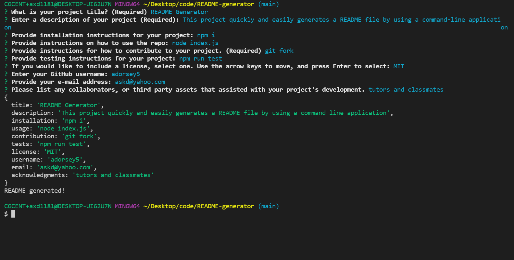

# README-generator
a command-line application that dynamically generates a professional README  
[README template](./templateREADME.md) 
Watch the video for the 
[README Generator](https://drive.google.com/file/d/1M46HDs_kjA2SzV0v7zH_ZlWSck7NUUdi/view) 
Screenshots below:

